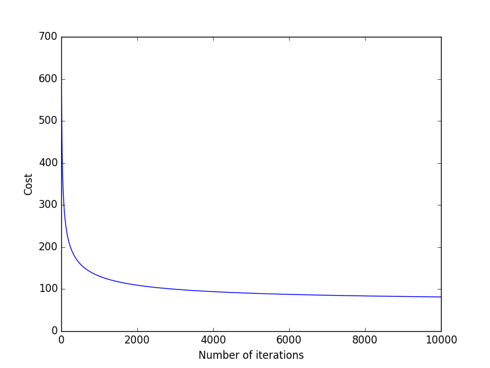

# LogisticRegression
Alpha (learning rate)               : 1 
Epoch (num_iters)                   : 10,000 
Accuracy (as predicted on test set) : 97.77 
Theta (approx) : [-1.97, 0.53, -0.99, -25.71, 7.42, -0.07, 19.80] 

<h3>Description:</h3>
The folder contains 5 main .py files. 

1. LogisticReg.py 
2. costAndGrad 
3. gradientDesc 
4. sigmoid 
5. calcAccuracy 

The graph of cost(J) vs number of iterations is plotted while descending. 

